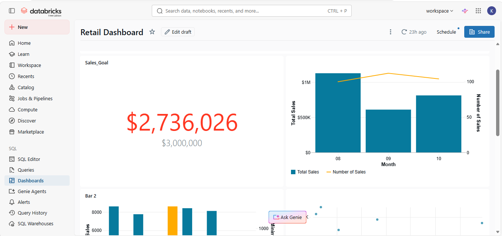
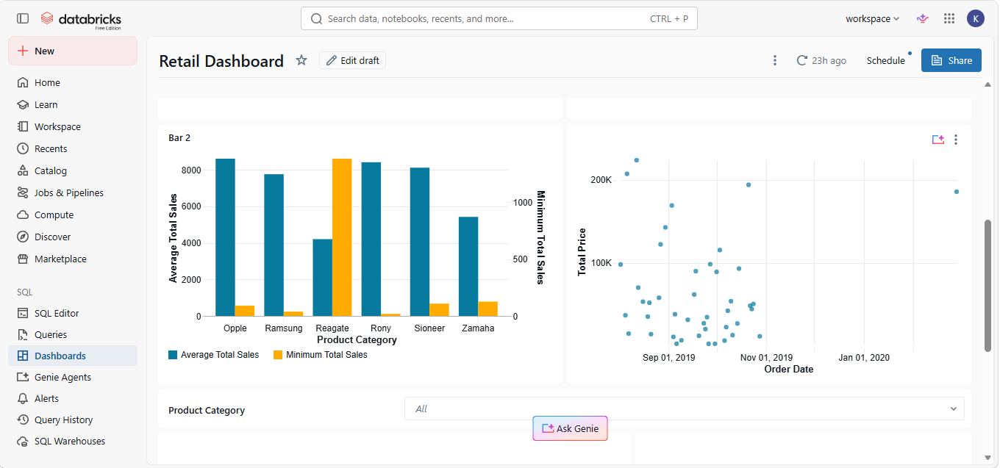
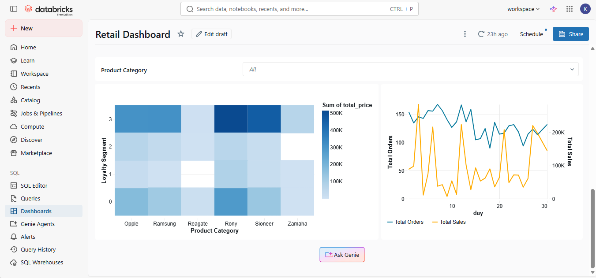

# Retail Sales Dashboard (Databricks)

An interactive retail sales dashboard built in Databricks, using SQL queries to analyze sales performance against goal, product category trends, and customer loyalty segments.

*Sales vs. goal and monthly sales trend*

*Product category performance*

*Loyalty segment heatmap and daily orders vs. sales*

> Note: this project is based on a Databricks Academy guided lab using a simulated retail dataset (product names are placeholder brand names). I completed the lab's SQL steps myself — writing joins and CTEs to build the loyalty-segment heatmap and the daily orders-vs-sales chart — and used the resulting dashboard to draw the findings below.

## What the dashboard covers
- **Sales vs. Goal:** KPI tracking of actual sales against a monthly/quarterly target
- **Monthly sales trend:** total sales and number of sales by month
- **Product category × loyalty segment:** a heatmap showing which product categories generate the most revenue within each customer loyalty tier
- **Daily orders vs. sales:** a time series comparing total daily order count against total daily sales value

## Tools
- Databricks (SQL Editor, Dashboards)
- SQL (aggregation queries: `GROUP BY` on category, loyalty segment, and month; joins across orders and product tables)

## Key Findings

**Sales vs. Goal:**
- Actual sales: **$2,736,026** against a goal of **$3,000,000**
- **91.2% of goal achieved** — a shortfall of roughly $264,000

**Monthly trend:**
- August was the strongest month, just over $1M in sales
- September dropped sharply to roughly $500-600K, the lowest of the three months
- October partially recovered to around $750K
- Notably, the **number of sales stayed relatively flat (~90-100)** across all three months while total sales value swung significantly — meaning the dip wasn't driven by fewer transactions, but by a drop in average order value

**Product category × loyalty segment:**
- The highest-value combination is **top loyalty-tier customers (Segment 3) buying from the "Reagate" category** (~$500K, the darkest cell on the heatmap)
- Lower loyalty segments show consistently lighter revenue across all categories, suggesting loyalty tier is a stronger revenue driver than product category alone

**Daily orders vs. sales value:**
- Total daily order count stayed fairly steady (roughly 100-170 orders/day)
- Total daily sales value was far more volatile, with spikes and dips that don't closely track order count
- This indicates **day-to-day revenue swings are driven more by changes in order value than by changes in order volume** — a distinction worth flagging for pricing/promotion strategy

## File
See [`retail_dashboard_queries.sql`](./retail_dashboard_queries.sql) for the SQL behind this dashboard, or open the published dashboard link directly in Databricks.
